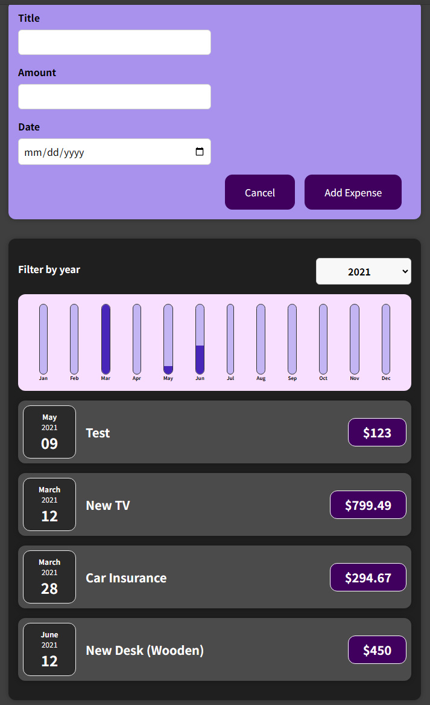

# React Chart UI Application

This project is a React-based application that demonstrates the use of a dynamic chart UI to display and filter expenses data. The app supports features like adding new expenses, filtering expenses by year, and visually representing data using charts.

## Features

- Add new expenses with title, amount, and date.
- Filter expenses by year.
- Display a chart showing monthly expense data dynamically.
- Responsive and interactive UI built with React.

## Technologies Used

- React (with functional components and hooks).
- CSS for styling components.
- JavaScript for application logic.

## Installation

Follow the steps below to set up and run the project:

1. **Clone the Repository**:
   ```bash
   git clone https://github.com/almirkopic/ReactAPP-ChartUI.git
   cd ReactAPP-ChartUI
